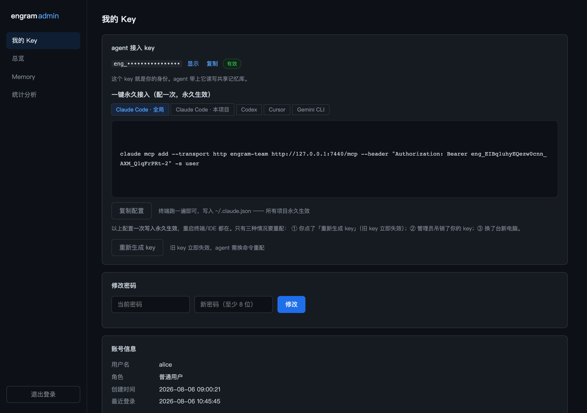
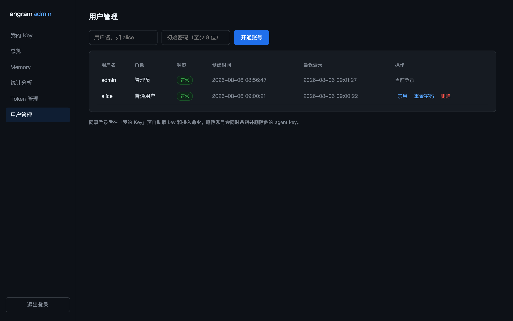

# engram-lan

**LAN-shared persistent memory for AI agents — multi-token network transport patch for [engram](https://github.com/Gentleman-Programming/engram) + a read-only admin panel.**

**把 engram 变成局域网共享记忆库：多 token 网络传输补丁 + 只读管理面板（授权管理 / memory 查看 / 统计分析）。**

[](LICENSE)
[](https://go.dev)
[](https://github.com/Gentleman-Programming/engram)

---

## English

### What is this?

[engram](https://github.com/Gentleman-Programming/engram) gives AI coding agents persistent memory, but its MCP server speaks **stdio only** — one process per agent, same machine only. There is no way for a team to share one memory base across a LAN.

**engram-lan** fixes that with two pieces:

| Piece | What it does |
|---|---|
| **`patches/engram-lan-mcp-v2.patch`** | Adds `--http <addr>` to `engram mcp` (streamable HTTP transport from mcp-go, same `MCPServer` object — tools untouched) plus bearer-token auth backed by a **multi-account token list file** with hot reload. ~230-line diff, one file: `cmd/engram/main.go`. Without `--http`, behavior is 100% upstream. |
| **`admin/`** | A zero-dependency Go binary serving a web panel on your LAN: user accounts with roles (admin + self-service members), per-person token issue/revoke (no service restart), read-only memory browser with full-text search, and global statistics dashboards. |

One server process owns the SQLite file; every agent on the LAN talks to the same memory base over HTTP.

### Why not engram cloud serve?

Upstream's `engram cloud serve` is a **sync backend** (Postgres + JWT): every client still runs a local stdio MCP against its own SQLite and pushes/pulls chunks in the background. That's N eventually-consistent replicas. engram-lan is **one shared base** — what a team knowledge base wants.

### Screenshots

| Overview dashboard | Memory browser |
|---|---|
|  |  |

| Memory detail | Statistics |
|---|---|
|  |  |

| My Key (member self-service) | User management (admin) |
|---|---|
|  |  |

### User accounts & self-service keys

The panel has a real account system with two roles:

- **Admin** (seeded from `ENGRAM_ADMIN_PASS_BCRYPT` on first run): everything a member can do, plus **User management** (create/disable/reset-password/delete accounts) and the legacy **Token 管理** page. Deleting a user also deletes their agent token.
- **Member**: logs in with username + password, lands on **我的 Key / My Key** — one click to mint or regenerate their personal agent token (old one dies instantly, hot-reloaded by the server), plus **copy-ready permanent-config snippets for Claude Code (global `-s user` / project `-s project`), Codex, Cursor, and Gemini CLI**, each with its own copy button and the config file path it lands in. Members can also change their own password and browse the read-only memory/stats pages.

Sessions carry roles; every admin-only API is enforced server-side (`403` for members), not just hidden in the nav.

### In action

**Panel tour — dashboard, trends, browsing, detail:**


**Issue a per-person token, revoke it — effective immediately, no restart:**


**Full-text search (SQLite FTS5, BM25-ranked):**


### Architecture

```
agent A ──┐
agent B ──┼── HTTP + JSON-RPC (Bearer token) ──▶ engram-mcp :7440
agent C ──┘                                      │  patch v2: token-list auth
                                                 │  (hot-reloads tokens.json)
                                                 ▼
                                          store.Store (single process)
                                                 ▼
                                          SQLite WAL + FTS5
                                                 ▲
you ── browser ──▶ engram-admin :7441 ───────────┘
                   (login, token mgmt, read-only memory view + stats)
```

Design constraints that shaped this:

- **SQLite WAL requires shared memory (`-shm`) with local filesystem lock semantics** — a network drive would corrupt the database. So one process must own the file; everyone else goes over the network. This is not a choice, it's physics.
- **Read-only is enforced by the OS, not by good intentions**: the admin panel runs as a dedicated user whose group has read-only permission on the DB directory/files, *and* opens SQLite with `mode=ro`. Even a compromised panel cannot write the memory base.
- **Token-list file is the single write surface**: the panel writes it atomically; the engram server reloads on mtime change and fails closed (all 401) if it is missing or corrupt.

### Quick start

Requires Go ≥ 1.26 and a Linux server for the shared instance (cross-compilation shown below).

```bash
# 1. build the patched engram server
git clone --depth 1 -b v1.20.0 https://github.com/Gentleman-Programming/engram /tmp/engram
cd /tmp/engram && git apply /path/to/engram-lan/patches/engram-lan-mcp-v2.patch
CGO_ENABLED=0 GOOS=linux GOARCH=amd64 go build -o engram-lan ./cmd/engram

# 2. build the admin panel
cd /path/to/engram-lan/admin
CGO_ENABLED=0 GOOS=linux GOARCH=amd64 go build -o engram-admin .

# 3. on the server: install + systemd (see docs/CONFIG.md for full reference)
sudo install -m755 engram-lan /usr/local/bin/engram
sudo install -m755 engram-admin /usr/local/bin/engram-admin
sudo useradd --system --no-create-home --shell /usr/sbin/nologin engram
sudo useradd --system --no-create-home --shell /usr/sbin/nologin engramadm
sudo usermod -aG engram engramadm
sudo mkdir -p /var/lib/engram-mcp/.engram /etc/engram-mcp
# ... systemd units + env files: copy from docs/, adjust, daemon-reload, enable --now

# 4. admin password (run locally, put the hash in /etc/engram-mcp/admin.env)
./engram-admin hashpw        # password on stdin, prints bcrypt hash

# 5. connect an agent
claude mcp add --transport http engram-team http://<server>:7440/mcp \
  --header "Authorization: Bearer <token-issued-in-panel>"

# 6. open the panel
open http://<server>:7441
```

### Security model

| Layer | Mechanism |
|---|---|
| Network auth | Per-person bearer tokens in a JSON list; constant-time comparison; revoked/missing/corrupt → 401 (fail-closed); 401s logged with source IP |
| Panel auth | Account system in panel-owned SQLite (`ENGRAM_ADMIN_DB`): bcrypt passwords, roles (admin/member), in-memory sessions (HttpOnly + SameSite=Strict cookies), login rate limit 5/5min/IP; admin-only APIs enforced server-side |
| DB integrity | Panel is physically read-only (fs perms + `mode=ro`); server is the only writer |
| Same-host users | DB dir `750`, files `640`, group = `engram`; only the panel user is in that group — other shell users cannot read the file at all |
| Token storage | List file `0660 panel:engram`; server reads via group, panel writes atomically (tmp+rename) |

No TLS — it is plain HTTP inside your LAN. Do not expose either port outside it.

### Limitations

- Write path requires the project name to be resolvable **server-side** (`--project` default or pre-seeded projects); the server has no client cwd. Reads are unrestricted.
- One shared knowledge space: everything stored is readable by everyone with a token. Keep private memories in your local engram.
- Panel sessions live in memory: a panel restart logs everyone out (tokens and data are unaffected).

---

## 中文文档

### 这是什么

[engram](https://github.com/Gentleman-Programming/engram) 给 AI coding agent 提供持久记忆，但它的 MCP 只有 **stdio 传输**——一个 agent 一个进程、只能在同一台机器上。团队没法共用一个记忆库。

**engram-lan** 用两个组件解决这个问题：

| 组件 | 作用 |
|---|---|
| **`patches/engram-lan-mcp-v2.patch`** | 给 `engram mcp` 加 `--http <addr>`（复用 mcp-go 自带的 streamable HTTP 传输，同一个 `MCPServer` 对象，18 个工具一行没改）+ 基于**多账号 token 名单文件**的鉴权，热重载。约 230 行 diff，只碰 `cmd/engram/main.go`。不带 `--http` 时行为与上游完全一致。 |
| **`admin/`** | 零依赖 Go 单二进制，在局域网提供 Web 管理面板：账号体系（管理员 + 普通成员，成员自助取 key）、按人签发/吊销 token（**不用重启服务**）、只读 memory 浏览（全文搜索）、全局统计大盘。 |

一个服务进程独占 SQLite 文件，网段内所有 agent 通过 HTTP 读写**同一个库**。

### 为什么不用上游的 cloud serve

上游 `engram cloud serve` 是**同步后端**（Postgres + JWT）：每个客户端仍跑本地 stdio MCP 对自己的 SQLite，后台推拉 chunk —— 是 N 份副本最终一致。engram-lan 是**同一个库**，这才是团队知识库要的语义。

### 截图

| 总览大盘 | Memory 浏览 |
|---|---|
|  |  |

| 记忆详情 | 统计分析 |
|---|---|
|  |  |

| 我的 Key（成员自助） | 用户管理（管理员） |
|---|---|
|  |  |

### 账号体系与自助取 key

面板是完整的账号系统，两种角色：

- **管理员**（首次启动用 `ENGRAM_ADMIN_PASS_BCRYPT` 播种）：拥有成员全部能力，外加**用户管理**（开通/禁用/重置密码/删除，删除会连带吊销并删除该用户的 agent token）和 **Token 管理**页。
- **普通成员**：用户名 + 密码登录，落地页就是**我的 Key**——一键生成/重新生成自己的 agent key（旧 key 立即失效，服务端热重载），并提供 **Claude Code（全局 `-s user` / 本项目 `-s project`）、Codex、Cursor、Gemini CLI 四种客户端的永久配置片段**，每段都带复制按钮和它写入的配置文件路径说明，复制即用、一次配置永久生效。成员还可以自助改密码、浏览只读的 memory/统计页。

会话带角色，所有管理员 API 在服务端强校验（成员访问返回 403），不只是藏导航。

### 动图演示

**面板全流程 —— 大盘、趋势切换、浏览、详情：**


**按人签发 token、吊销 —— 立即生效，无需重启：**


**全文搜索（SQLite FTS5，BM25 打分）：**


### 架构

```
agent A ──┐
agent B ──┼── HTTP + JSON-RPC（Bearer token）──▶ engram-mcp :7440
agent C ──┘                                      │  补丁 v2：token 名单鉴权
                                                 │ （mtime 变化自动热重载）
                                                 ▼
                                          store.Store（单进程持有）
                                                 ▼
                                          SQLite WAL + FTS5
                                                 ▲
你 ── 浏览器 ──▶ engram-admin :7441 ─────────────┘
                 （登录、token 管理、只读 memory + 统计）
```

设计取舍背后的硬约束：

- **SQLite 的 WAL 模式需要共享内存（`-shm`）和本地文件锁语义**——放网络盘会坏库。所以必须一个进程独占文件，其他人走网络。这不是选择，是物理。
- **只读由操作系统保证，不靠自觉**：面板跑在专用用户下，组权限对库只有读，且代码层 `mode=ro` 打开。面板就算被攻破也写不了库。
- **token 名单文件是唯一写面**：面板原子写入，engram 按 mtime 热重载；文件丢失或损坏时 fail-closed（全部 401）。

### 快速开始

需要 Go ≥ 1.26，以及一台跑共享实例的 Linux 服务器（下面是交叉编译示例）。

```bash
# 1. 编译打过补丁的 engram 服务端
git clone --depth 1 -b v1.20.0 https://github.com/Gentleman-Programming/engram /tmp/engram
cd /tmp/engram && git apply /path/to/engram-lan/patches/engram-lan-mcp-v2.patch
CGO_ENABLED=0 GOOS=linux GOARCH=amd64 go build -o engram-lan ./cmd/engram

# 2. 编译管理面板
cd /path/to/engram-lan/admin
CGO_ENABLED=0 GOOS=linux GOARCH=amd64 go build -o engram-admin .

# 3. 服务器上安装 + systemd（完整配置参考 docs/CONFIG.md，unit 示例在 docs/ 下）
sudo install -m755 engram-lan /usr/local/bin/engram
sudo install -m755 engram-admin /usr/local/bin/engram-admin
sudo useradd --system --no-create-home --shell /usr/sbin/nologin engram
sudo useradd --system --no-create-home --shell /usr/sbin/nologin engramadm
sudo usermod -aG engram engramadm
sudo mkdir -p /var/lib/engram-mcp/.engram /etc/engram-mcp

# 4. 面板密码（本地生成哈希，写进 /etc/engram-mcp/admin.env）
./engram-admin hashpw        # 密码从 stdin 读，输出 bcrypt 哈希

# 5. 同事接入（token 在面板里签发）
claude mcp add --transport http engram-team http://<服务器>:7440/mcp \
  --header "Authorization: Bearer <token>"

# 6. 打开面板
open http://<服务器>:7441
```

### 安全模型

| 层 | 机制 |
|---|---|
| 网络鉴权 | 按人 bearer token，名单文件热重载；constant-time 比对；吊销/文件损坏 → 401（fail-closed）；401 记来源 IP |
| 面板登录 | 面板自有 SQLite 账号库（`ENGRAM_ADMIN_DB`）：bcrypt 密码、角色（管理员/成员）、内存会话（HttpOnly + SameSite=Strict）、登录限流 5 次/5 分钟/IP；管理员 API 服务端强校验 |
| 库完整性 | 面板物理只读（文件系统权限 + `mode=ro`）；服务端是唯一写入者 |
| 同机用户隔离 | 库目录 `750`、文件 `640`、组 `engram`；只有面板用户在组里，其他 shell 用户读不到文件 |
| token 存储 | 名单 `0660 面板用户:engram`；原子写（tmp+rename），服务端只读 |

没有 TLS —— 局域网内明文 HTTP。两个端口都不要暴露到内网之外。

### 已知限制

- 写入的项目名必须**在服务端有据可查**（`--project` 默认值或预先 seed 过的项目）；服务端没有客户端的工作目录。读取不受此限。
- 库是全组共享读写的：私人记忆留在你本机的本地 engram。
- 面板会话在内存：面板重启会要求重新登录（token 和数据不受影响）。

### 配置参考

全部环境变量、文件权限、端口、API 列表见 **[docs/CONFIG.md](docs/CONFIG.md)**。

### 升级与回滚

- 上游 engram 出新版：重新 clone → `git apply patches/engram-lan-mcp-v2.patch` → 重编替换。补丁只碰一个文件，冲突看 `cmdMCP` 尾部与 `tokenList`。
- 面板是独立程序，上游升级不影响；改完 `admin/` 直接交叉编译替换重启。
- 完全卸载：disable 两个 unit → 删二进制/配置/数据目录 → 删两个系统用户。全部部署内容均为新增，不改 nginx 或任何现有服务。

## License

MIT — see [LICENSE](LICENSE). The patch targets engram v1.20.0 (MIT, © Alan Buscaglia); upstream copyright is preserved.
